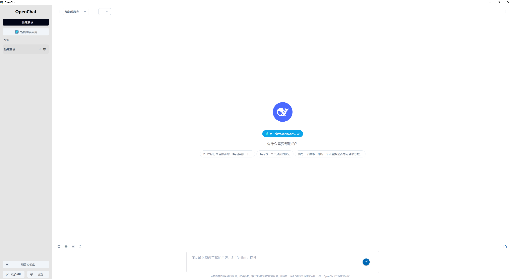

<p align="right">
  <a href="./README.md">中文</a> | English

### Download for Desktop
<table style="width: 100%">
  <tr>
    <td width="25%" align="center">
      <b>Windows</b>
    </td>
    <td width="25%" align="center">
      <b>MacOS</b>
    </td>
    
  </tr>
  <tr style="text-align: center">
    <td align="center" valign="middle">
      <a href='https://metabrain.oss-cn-beijing.aliyuncs.com/openchat/OpenChatSetup.exe'>
        
        <br />
        <b>Setup.exe</b>
      </a>
    </td>
    <td align="center" valign="middle">
      <a href='https://metabrain.oss-cn-beijing.aliyuncs.com/openchat/OpenChat.dmg'>
        
        <br />
        <b>Intel</b>
      </a>
    </td>
    
    
  </tr>
</table>

---


# OpenChat - Your All-in-One AI Platform


OpenChat is a client application that provides a conversational AI experience powered by large models. It allows users to easily interact with multiple AI models for knowledge-based Q&A, web information retrieval, knowledge management, and document-based conversations.



---

## Key Features

### 🚀 **Intelligent AI Assistant Platform**

- 🌐 **Compatible with Leading Cloud-based AI Models**: Supports OpenAI, Deepseek, Silicon Flow, etc.
- 🔗 **Integrated with Popular AI Platforms**: Tencent Cloud, Baidu Qianfan Cloud, Kimi AI, Chatglm, etc.
- 🖥 **Supports Local Model Deployment**: Compatible with Ollama, on-premise server deployment, and other offline solutions.

### 🧠 **Versatile AI Assistant**
- 🤖 **AI Assistant Applications**: Integrates Kimi, Meta AI Search, Wenxin Yiyan, Doubao, and more for seamless access to multiple AI platforms.
- 🔍 **Sensitive Content Detection**: Accurately identifies sensitive content to ensure compliance.
- 📚 **Knowledge-based Q&A**: Intelligently processes various inquiries and provides reliable answers.

### 🌍 **Powerful Information Retrieval & Knowledge Management**
- 🔗 **Web Information Retrieval**: Real-time search for the latest data to aid decision-making.
- 📖 **Intelligent Knowledge Base**: Personalized knowledge storage for easy management and access.
- 📝 **Document-based Conversations**: Supports interactive Q&A for text, PDF, and Office documents, enhancing reading efficiency.

### 🧩 **Practical Tools & Extended Features**
- 🔎 **Smart Search**: Quickly locate information and improve efficiency.
- 🌐 **Multi-modal Support**: Handles text, images, and various document formats.
- 📤 **Content Management & Sharing**: Easily organize and share knowledge.

### ✨ **Exceptional User Experience**
- 🖥 **Cross-platform Compatibility**: Supports Windows and macOS.
- ⚡ **Plug and Play**: No complex configuration required; ready to use out of the box.
- 📑 **Markdown Rendering**: Clear and structured document presentation.
- 🚀 **High Performance & Stability**: Ensures a smooth and efficient experience.
- 💡 **Multi-model Interaction**: Gain insights from different perspectives.

<br>

---

### 📃 Upcoming Features

- [x] Multi-model result comparison for diverse perspectives
- [x] AI Assistant applications
- [x] Personalized data backup
- [x] Updated sensitive content detection
- [x] Full model internet access support
- [x] Enhanced web search features
- [x] Knowledge base and document conversation updates
- [x] First official release
- [x] Continuous improvements and performance optimizations
- [ ] Custom prompt creation
- [ ] Immersive translation
- [ ] AI coding assistant
- [ ] Personalized AI agents

More features coming soon...

---

## 💻 Configuration & Usage

### 1. System Requirements
Memory: 8GB or more
Operating System: Windows 10/11 (64-bit) & macOS (Intel chip)

### 2. Installation
#### Step 1: Download OpenChat Installer
- OpenChat User Guide (this document) provides download, installation, and usage instructions.
- OpenChat Installer (Windows): `OpenChatSetup.exe`
- OpenChat Installer (macOS): `OpenChat.dmg`

#### Step 2: Install OpenChat Client
After downloading `OpenChatSetup.exe`, double-click the file, accept the user agreement, select the installation path (e.g., `X:\...\OpenChat`), and wait for the automatic installation to complete.

For macOS, open `OpenChat.dmg`, then drag `OpenChat.app` to the Applications folder. Due to the security protection mechanism of the MacOS system, if a risk warning appears when it is opened, choose to trust the program. If the program cannot be opened because the developer cannot be verified, you can double-click it again to open it or click Open Still under the Security tab in System & Preferences.

### 3. Usage
For detailed explanations of features and instructions on how to use the program, please refer to <a href="./doc/intro/userguide.md">OpenChat User Guide</a>.

<br>

---

## 📦 Packaging & Deployment

OpenChat supports packaging and distribution on **macOS** and **Windows**. Below are the basic packaging steps.

### 🍎 macOS Packaging Guide

1. **Environment Preparation**: Ensure Python 3.10 and necessary dependencies are installed.
2. **Code Adjustments**: Modify paths, permissions, and other settings for macOS compatibility.
3. **Use PyInstaller for Packaging**:
   ```sh
   pyinstaller --clean --onedir --windowed --name "OpenChat" \
     --add-data "pkg:pkg" \
     --add-data "assets:assets" \
     --osx-bundle-identifier com.example.openchat \
     --hidden-import=imghdr \
     yuanchat.py
   ```
4. **Manually Add Missing Dependencies**: Copy missing `site-packages` dependencies to the `Frameworks` directory.
5. **Create a DMG Package** (Optional):
   ```sh
   hdiutil create -volname "OpenChat" -srcfolder "dist/OpenChat.app" -ov -format UDBZ "OpenChat.dmg"
   ```

📄 **Detailed macOS Packaging Guide** 👉 [Mac Packaging Guide](doc/packaging/mac_packaging.md)

---

### 💻 Windows Packaging Guide

1. **Install Python and Dependencies** (Recommended: 3.10.11/3.10.12 versions).
2. **Create Virtual Environment and Install Dependencies**:
   ```sh
   pip install virtualenv
   virtualenv venv --python=python3.10.11
   pip install -r requirements.txt
   ```
3. **Adjust Python Dependencies**:
   - Modify `pypandoc` and `pytesseract` related code.
   - Place `nltk_data` into the `venv/Lib` directory.
4. **Use PyInstaller to Generate Executable File**:
   ```sh
   pyinstaller -D openchat.py
   pyinstaller openchat.spec
   ```
5. **Run `openchat.exe` and Test Dependencies**: Manually add missing dependencies to the `_internal` directory.
6. **Use Inno Setup to Create an Installation Package** (Requires [Inno Setup Compiler](https://jrsoftware.org/isdl.php)).
7. **Execute `openchatsetup.iss` to Build the Final Installation Package**.

📄 **Detailed Windows Packaging Guide** 👉 [Windows Packaging Guide](doc/packaging/windows_packaging.md)

<br>

### 📌 Notes
- **It is recommended to use Python 3.10 and a virtual environment (venv) for isolation on all platforms**.
- **If dependencies are missing after packaging, check `site-packages` and manually add them**.
- **For Windows, Inno Setup is recommended for installation package creation**.
- **For both macOS and Windows, code signing is recommended to enhance security**.
