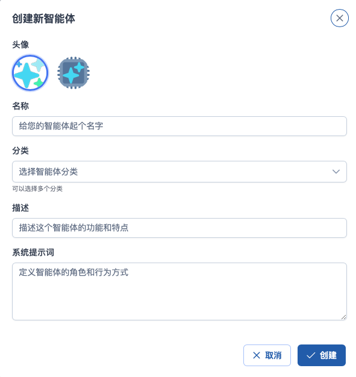
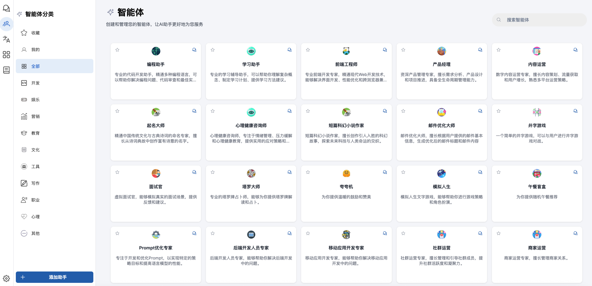
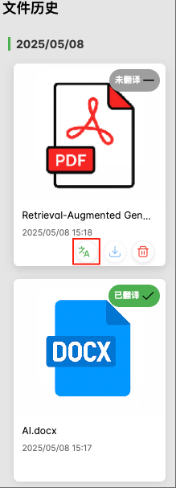

## 📝 更新日志 | OpenChat v1.0.2

> 发布日期：2025年5月8日  
> 版本代号：v1.1.0

此版本是一个重要更新，新增两个核心功能：**智能体系统** 与 **沉浸式翻译模块**，显著提升了 OpenChat 的个性化能力与多语言处理能力。

---

### ✨ 新功能亮点

#### 🤖 智能体系统（Agent System）

用户现在可以自主创建和管理个性化的智能体，赋予其独特的行为逻辑：

- **自定义智能体**：填写名称、分类、行为描述和系统提示词，快速创建属于你的专属智能体。  
  

- **预制智能体助手**：无需配置，点击即可启用如编程助手、学习助手、产品经理等专业智能体，提升效率。  
  

- **智能体会话窗口**：专属对话界面，支持模型切换、上下文记忆和智能推荐。  
  

---

#### 🌐 沉浸式翻译模块（Immersive Translation）

一体化文档翻译与文本翻译体验，支持中/英/日/韩/法 5 种语言互译：

- **文件翻译支持多格式**：上传 PDF、DOCX、TXT 文件即可自动识别内容并翻译。  
  

- **沉浸式翻译主界面**：
  - **左侧**：文件翻译历史区，查看翻译状态与结果
  - **右侧**：文本翻译输入框、术语表配置与翻译历史功能集成  
  

- **灵活预览模式**：
  - 原文与译文同步展示
  - 支持隐藏原文，仅保留译文内容
  - 可选开启同步滚动功能，提升阅读体验  
  

---

#### 🛠 其他优化

- 智能体系统与翻译模块状态记忆支持
- 修复多个平台模型切换异常的问题
- 优化多语言界面提示、组件兼容性适配

